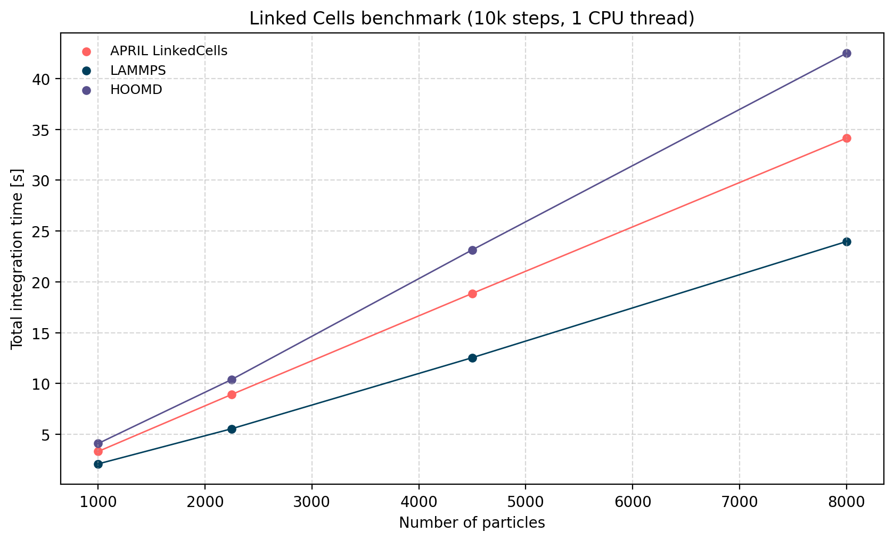

# APRIL -  A Particle Runtime Interaction Library


**APRIL is a compact, modular C++23 library for particle-based simulations with the goal to combine usability and high performance.**

It provides an expressive, easy-to-use API with clear setup path and extensible interfaces - with zero-cost abstractions in hot paths.  
The design emphasizes modularity, plug-and-play components, and modern C++ (concepts, TMP, CRTP-style dispatch).

> **Status**: Core architecture complete.  
> **Next**: expanded tests, SoA containers, internal SIMD API, and OpenMP parallelism.

## Core Features

- **Modular design**: seamlessly swap, extend or create your own components: (inter particles) **forces**, **containers** (force calculators), **boundary conditions**, **controllers** (e.g. Thermostats), **Force fields**, **integrators**, and **monitors**.
- **Modern C++**: concepts for compile-time interface checking; CRTP & template-meta programing for maximum performance; Variants for run time flexibility.
- **Ergonomic setup**: clear setup path. Special care was taken to minimize template verbosity with automatic template deduction (CTAD).
- **Zero-cost, type-safe particle access**: Views expose only the fields needed (e.g. position, velocity, force) with **compile-time safety** (no runtime checks and thus no overhead; unused fields are eliminated)
- **Tested core**: GoogleTest suite covering interactions, containers, boundary conditions, integrator steps, binary I/O, and utilities.
- **Small animation script**: a Python helper to quickly preview simulation output.

### Built-in Components
- **Forces**: Lennard Jones (12-6), Power law force, Harmonic (spring force)
- **Boundary conditions**: Periodic, Repulsive (uses a force), Reflective, Absorbing and Open boundary conditions
- **(Force) Fields**: Uniform (global & constant) field, local field (optionally time dependent)
- **Controllers**: a simple velocity scaling thermostat
- **Containers**: `DirectSum` (all-pairs) and `LinkedCells` (cell lists).
- **Monitors**: binary snapshots, terminal diagnostics, progress bar, and a simple benchmark.
- **Integrators**: Størmer–Verlet, Yoshida4

## Getting Started

**Requirements:**
- C++23-capable compiler (e.g. gcc-14, clang 18)
- CMake ≥ 3.28
- (Dev) GoogleTest for running the test suite

**Build Guide:**
From the project root run:
```bash
cmake -S . -B build
cmake --build build -j
```

To run tests use
```bash
ctest --test-dir build --output-on-failure
```

## Architecture

The following diagram shows the typical flow of a program using APRIL:
```
           [particles]   [boundaries]   [forces]          
                     \        |        /                          
                      v       v       v                           
                       +-------------+        
         [fields] ---> | Environment | <--- [controllers]       
                       +-------------+        
                              |                       
                              |                        
                              v                       
+-----------+      +---------------------+     transforms user-provided data (particles, 
| Container | ---> |   build_system(...) |  <- types/IDs, forces, domain) into dense internal
+-----------+      +---------------------+     representations and wires the components together.
                              |
                              v
                         +---------+
                         | System  |   <— uses Container to compute forces
                         +---------+
                              ^
                              |  (each step: system.update_forces)
                              |
                       +-------------+
                       | Integrator  |
                       +-------------+
                              |
                              |  emits records based on custom trigger policies
                              v
                        +-----------+
                        | Monitors  |
                        +-----------+
```

- **Environment** \
Defines the simulation setup. In other words it contains all relevant physics: particles, simulation domain (origin/extent), boundary conditions, force fields, controllers and the list of interactions (by **type pair** or **id pair**).
- **System** \
Materializes the environment: maps user IDs/types to dense internals, builds interaction tables, finalizes the domain, and wires everything together.
- **Container** \
Owns internal particle storage/indices and computes pairwise forces (e.g., **DirectSum**, **LinkedCells**). It’s injected with the interaction manager built by the system.
- **Integrator** \
Advances the state in time. On each step it updates positions/velocities and asks the system to refresh forces.
- **Monitors** \
Optional observers with custom invocation policies (Triggers). They’re the primary way to emit output (binary frames, progress, timing, etc.).

## Design Notes
- The entire public API is collected in april/april.h, so users normally only need a single include.
- Clear separation of user-facing vs. internal API: users work with declarative structs (e.g., `Environment`, `Particle`, container config structs) which are then used to build the internal representations. This keeps the public API ergonomic and stable while allowing optimized internal implementations.
- Concepts enforce component interfaces at compile time (IsForce, IsMonitor, IsBoundary, IsSystem, ..) for better error handling.
- Environment → System → Integrator is the central workflow. Systems always delegate force evaluation to a chosen Container.
- Interactions can be specified by type pair or by particle id pair; missing cross-type entries are derived via a mix function.
- BinaryOutput writes a compact, versioned binary format (positions as float, plus type/id/state) suitable for lightweight analysis or visualization.
- Defaults (e.g., automatic domain extent/origin) are provided, but can always be overridden explicitly.
- Internal particle access highly optimized; internal views expose only the required fields (e.g., position, force) with compile-time guarantees; no runtime overhead, unused fields are eliminated at compile time.

## Usage (minimal example)
```c++
#include <april/april.h>
using namespace april;

// Simulation of a simple sun-planet system
int main() {
    // 1) Define an environment: particles + force types + boundary types
	// constructor requires type information on, at run time, usable components
	// possible template packs are: forces, boundaries, fields, controllers
    auto env = Environment (forces<InverseSquare>, boundaries<Outflow>)
        .with_particle(/*pos*/ {0,0,0}, /*vel*/ {0,0,0}, /*mass*/ 1.0, /*type*/0)   // Sun
        .with_particle(/*pos*/ {1,0,0}, /*vel*/ {0,1,0},/*mass*/ 1e-5, /*type*/0)   // Planet
        .with_force(InverseSquare(), to_type(0))                                    // gravity for type 0
        .with_boundaries(Outflow(), all_faces);                                     // all faces open

    // 2) Choose a container (force calculator) and build a system
    auto container = DirectSum();
    auto system = build_system(env, container);

    // 3) Integrate with Stoermer–Verlet and attach monitors
    auto integrator = StoermerVerlet (system, monitors<ProgressBar, Benchmark>)
        .with_monitor(ProgressBar(Trigger::every(50)))    // update every 50 steps            
        .with_monitor(Benchmark())                        // simple timing utility
        .run_for(0.01, 10.0);                             // dt = 0.01, T = 10.0
}
```

Further examples can be found in `examples/`:
- Halley’s Comet - small N-body system with gravitational InverseSquare forces.
- Two-Body Collision - MD-style collision with LennardJones interactions and explicit domain extents.
- Falling Water Drop - 2D simulation of a drop of liquid being dropped into a basin


## Benchmarks

Benchmarks were conducted for **10 000 integration steps** on a **single CPU thread** with Lennard–Jones interactions (ε = 5, σ = 1, cutoff = 3σ, dt = 0.0002).

**System:** simple cubic lattice of varying size (1000–8000 particles).  
**Hardware:** Windows 10, Intel Core i7-11370H @ 3.30 GHz.  
**Compilers / Versions:**
- APRIL: Clang 18.1.3 (via WSL)
- LAMMPS: 22 Jul 2025
- HOOMD: v5.3.1 (via WSL)
  
For comparison, both **“parity”** and **“production”** configurations were used. Parity mode disables optimizations such as Verlet buffers to approximately match APRIL’s linked cells implementation, to provide
a more direct comparison. Production mode corresponds to each library’s standard tuned settings.



| Particles | APRIL LinkedCells | LAMMPS Parity LC | LAMMPS Production LC | HOOMD Parity LC | HOOMD Production LC |
| --------- | ----------------: | ---------------: | -------------------: | --------------: | ------------------: |
| 8000      |            57.764 |           62.782 |               23.965 |         196.574 |              42.475 |
| 4500      |            31.367 |           33.130 |               12.548 |         104.548 |              23.148 |
| 2250      |            14.139 |           14.859 |                5.561 |          48.699 |              10.406 |
| 1000      |             4.527 |            5.608 |                2.102 |          18.591 |               4.107 |

APRIL’s linked-cell implementation achieves higher performance than HOOMD in parity configuration, which is expected given HOOMD’s primary focus on GPU execution. Compared to LAMMPS in parity configuration, APRIL shows a slight advantage of a few percent.
Production runs of LAMMPS and HOOMD achieve greater throughput by employing neighbor list buffering.
Overall, this is a promising result for APRILS performance potential as it currently does not employ any further optimization techniques (SoA storage, SIMD, neighbor list buffering).


## Extending APRIL

APRIL’s components are designed to be easy to extend and swap in and out. Each new component inherits from a CRTP (with C++23 syntax) base class and inherits missing methods. 
In the following the majority of nested namespaces inside april are omitted for brevity. 


### Custom force

Forces determine the pair wise interactions between particles. 
Implement the call `eval` and a `mix` rule (used to derive cross-type interactions). The `eval` method takes in two `ConstFetchers` provide particle data on demand.

```c++
struct MyForce : Force{
    using Force::Force; // or define your own constructor
    
    template<env::IsConstFetcher F>
    vec3 eval(const F& a, const F& b, const vec3& r) const noexcept {
        // your force logic here   
        // fields can be accessed with a.position(), b.velocity() ..             
    }
    
    MyForce mix(const MyForce& other) const noexcept {
        // your mixing logic here
    }
};
```

To add to a simulation, simply specify its type during environment declaration and add it:

```c++
Environment env (forces<MyForce>);
env.add_force(MyForce{...}, to_type(...));
```

### Custom boundary 

Boundaries determine what happens to the particles near or outside the simulation domain. 
To implement custom boundary logic, inherit from `Boundary` and set the topology parameters by initializing the base class. provide a const apply function: 

```C++
struct MyBoundary final : Boundary {
    MyBoundary() : Boundary(/*thickness*/ +1.0,
                 /*couples_axis*/ false,
                 /*force_wrap*/  false,
                 /*may_change_particle_position*/ true) {}
                 
    template<env::IsMutableFetcher F>
    void apply(F && p, const env::Box& box, boundary::Face face) const noexcept {
        // your boundary logic here    
        // fields can be accessed & mutated with p.position(), p.velocity() ..                   
    }
}
```


### Custom controller

Controllers are "god" objects, able to modify the system in non-physical ways.
Inherit from `Controller` to create a controller with custom logic:

```C++
struct MyController final : Controller {
    static consexpr env::FieldMask fields = 

    using Controller::Controller; // or define your own constructor
    
    // optional. called once at the beginning of the simulation
    template<class S>
    void init(core::SystemContext<S> & ctx){
        // your custom initilization logic here
    }
    
    // required. called every time should_trigger(ctx) evaluates to true 
    template<class S>
    void apply(core::SystemContext<S> & ctx) {
        // your custom controller logic here
    }
}
```

### Custom Field

Fields are used to implement force fields. Their apply function is called in every step and is restricted to only modify particle forces. 
To implement a custom force field inherit from `Field`:

```C++
struct MyField final : Field {
    using Controller::Controller; // or define your own constructor

    // optional. called once at the beginning of the simulation
    void init(const SimulationContext & ctx) {
        // your custom initilization logic here
    }
    
    // required. called during every integration step
    template<env::IsUserData U>
    void apply(const env::RestrictedParticleRef<fields, U> & particle) const {
        // your custom force field logic here 
        // only particle.force can be modified. All other attributes are read only
   }
    
    // optional. called during every integration step
    template<class S>
    void update(const core::SystemContext<S> & ctx) {
        // your custom update logic here
        // can be used e.g. for temporal dependence
    }
}
```


### Custom container

Containers are the most complex classes to implement as they are the backbone of the simulation. 
To create a custom container inherit from `Container<Config, Env>`and provide the following functions: 

- build
- register_all_particle_movements
- register_particle_movement
- calculate_forces
- id_to_index
- get_fetcher_by_id (optional, const & non const), 
- id_start, id_end
- get_particle_by_index (const & non const(), 
- index_start, index_end
- particle_count
- collect_indices_in_region

Additionally provide a struct pointing to the containers type. This is passed into the `Config` template parameter as well as into  `build_system(...).`

```c++
template <class Env> class MyContainerImpl; // forward declaration

struct MyContainer { // User facing declaration
    // requires the following field for the compiler
	template<class  Env> using impl = MyContainerImpl<Env>;
	... // optional user config data here
};

template <class Env>
class MyContainerImpl final : public Container<MyContainer, Env> {
    using Base = Container<MyContainerCfg, Env>;
    using Particle = typename Base::Particle;
public:
    using Base::Base; // forward config. To access config data use this->cfg.
	
    void build(const std::vector<internal::ParticleRecord> & particles) { ... }
    void calculate_forces() { ... }
    
    // provide all other methods like stable and non stable particle access,
    // regional queries and update signalers
    ...
};
```

Usage: 

```
auto system = build_system(env, MyContainer());
```

You can derive from `container::ContiguousContainer<Config, Env>` to reuse storage and id/index utilities. ContiguousContainer stores particles data in a single contiguous vector.

### Custom integrator

Inherit from `Integrator<System, MonitorPack<...>>` and provide `integration_step()`.

````c++
// forward declaration
template<IsSystem Sys, class MPack> class MyIntegrator;

// specialization to access monitor paramter pack Ms
template<IsSystem Sys, class... Ms>
class MyIntegrator<Sys, MonitorPack<Ms...>> : public Integrator<Sys, MonitorPack<Ms...>> {
 
    using Base = Integrator<Sys, MonitorPack<Ms...>>;
    using Base::sys; using Base::dt;

public:
    void integration_step() { ... }
};

// optional: provide CTAD for better ergnomics
````

### Custom monitor

Inherit from `Monitor` and implement `record(...)`. Optionally implement `before_step(...)` and `finalize()`.

```c++
class MyMonitor : public Monitor {
public:
    explicit MyMonitor(Trigger trigger) : Monitor(std::move(trigger)) {}

	template<class S>
    void record(const core::SystemContext<S> & ctx) {
        // emit logs, write files, aggregate stats, etc.
        // use the SimulationContext to query state, particles, etc. 
    }

    // optional
    // void init(...)
    // void before_step(...);
    // void finalize();
};
```

Usage: 
````c++
StoermerVerlet integrator(system, monitors<MyMonitor>);
integrator.add_monitor(MyMonitor(Trigger::every(10));  // call every 10 steps
````


## Roadmap

Planned additions (subject to change)

Foundational: 
- [x] Boundaries & boundary conditions
- [x] Controllers: e.g. thermostats
- [x] Force fields, including time-dependent fields
- [ ] Parallelism

Additional Features: 
- [ ] More integrators: 
  - [x] Yoshida4
  - [ ] Boris Pusher
- [ ] Barnes–Hut container
- [ ] SOA & SIMD support
- [x] Extendable particles via template parameter (e.g. add charge property)
- [ ] ~~C++ Modules~~ (wait for more widespread compiler support)
- [ ] more build feedback from `build_system` (e.g. spatial partition parameters) 
- [ ] Continuous integration
- [ ] python binding
