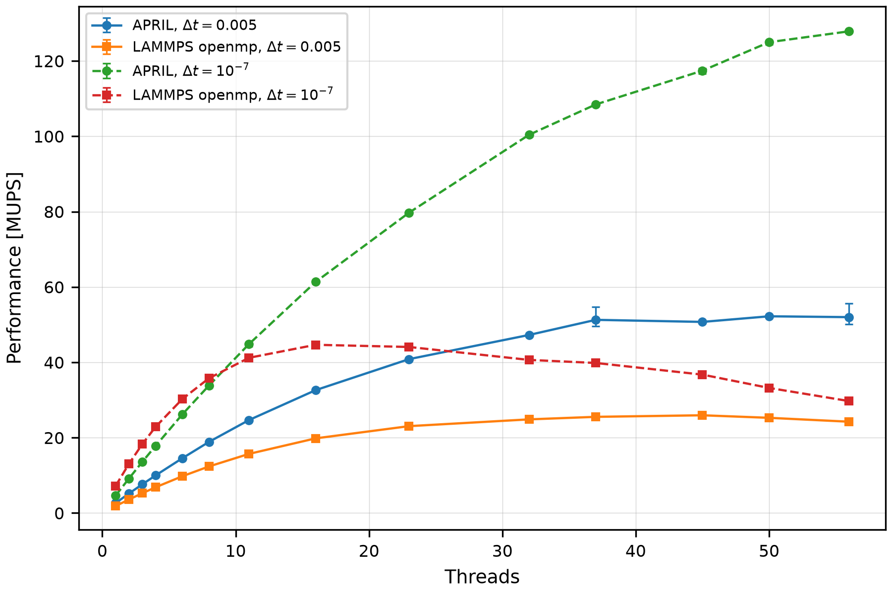

# APRIL -  A Particle Runtime Interaction Library

[](https://github.com/JKKDY/april/actions/workflows/cmake-multi-platform.yml)
[](https://codecov.io/github/JKKDY/april)
[](https://github.com/JKKDY/APRIL/actions)


APRIL is a header-only C++23 framework for custom particle simulations that compiles declarative simulation descriptions into specialized CPU execution paths across memory layouts, SIMD modes, and parallel backends.


> **Status**: Early WIP — API unstable. Core architecture, memory layouts, SIMD execution, and multithreading are implemented.  
> **Next**: Algorithmic improvements such as Verlet cluster lists, followed by distributed execution.


## Minimal Example

```c++
#include <april/april.hpp>
using namespace april;

// Simulation of a simple sun-planet-moon system
int main() {
	// Particle types are arbitrary integer labels used to select which interactions apply
	constexpr int DEFAULT = 0;
    
    // 1) Define particles and interactions
    auto sun = Particle().at(0, 0, 0).with_mass(1.0).as_type(DEFAULT);
    auto planet = Particle().at(1, 0, 0).with_velocity(0, 1, 0).with_mass(1e-3).as_type(DEFAULT);
    auto moon = Particle().at(1.05, 0, 0).with_velocity(0, 1.2, 0).with_mass(1e-6).as_type(DEFAULT);

	// Set up the simulation
    auto env = Environment(forces<Gravity>, boundaries<OpenBoundary>)
        .with_particles({sun, planet, moon})
        .with_force(Gravity(), to_type(DEFAULT))
        .with_boundaries(OpenBoundary(), all_faces); 

    // 2) Choose a container (force calculation strategy)
    auto container = DirectSum(); // defaults to AoSoA layout with vectorized execution 
    auto system = build_system(env, container); // "compilation step"

    // 3)  Integrate and write output
    VelocityVerlet(system, monitors<BinaryOutput>)
        .with_monitor(BinaryOutput(Trigger::every(40), "output/"))
        .with_dt(0.005)
        .for_duration(200)
        .run();                           
}
```

<br>


## Why APRIL?

APRIL is designed for particle simulations where users need custom physics and flexible composition without giving up high-performance CPU execution.

* **Clear, canonical setup path**: Describe particles, interactions, fields, boundaries, and integrators declaratively, then call `build_system(...)` to validate the configuration and materialize an executable, specialized simulation system.

* **Composable by design**: Containers, forces, fields, boundaries, integrators, monitors, executors and other components are orthogonal. Swapping one part, such as changing from `DirectSum` to `LinkedCells` or from AoS to SoA storage, does not require rewriting force kernels or unrelated components.

* **User components are first-class**: If APRIL does not provide the force law, traversal algorithm, output format, or executor you need, implement it yourself. Custom components compile into the same execution paths as built-in components.

* **Single-source kernels across layouts and execution modes**: Write particle kernels once against an AoS-style interface. APRIL specializes the same code for AoS, SoA, AoSoA, or custom storage layouts, and for scalar or SIMD execution.

* **Fast by specialization, flexible at runtime**: Available component types, memory layouts, field access, and execution paths are declared at compile time and remain visible to the compiler. Concrete component objects and parameters are assigned at runtime, keeping simulations configurable without routing hot paths through virtual dispatch or type-erased plugin layers.

* **SIMD and parallelism without clutter**: SIMD values mirror scalar semantics, while lane masking, rotations, reductions, tail handling, and shared-memory scheduling are handled by the framework. User kernels stay focused on physics logic.


## Getting Started

### 1. Requirements

- **C++23 capable compiler** (e.g. GCC 14, Clang 18)
- **CMake ≥ 3.28** (only for examples, tests, benchmarks)

The core library has no mandatory dependencies. The following optional dependencies are automatically fetched or detected by CMake:

- **GoogleTest** (dev): required for the test suite
- **xsimd**: default SIMD backend (enable with `APRIL_ENABLE_XSIMD`; falls back to `std::simd` if disabled)
- **OpenMP**: optional parallel backend (enable with `APRIL_ENABLE_OPENMP`; otherwise uses the native threading implementation)


### 2. Integration

APRIL is a header-only library. You can simply include the `include/` directory, or use CMake's FetchContent:

```cmake
include(FetchContent)
FetchContent_Declare(
    APRIL
    GIT_REPOSITORY https://github.com/JKKDY/april.git
    GIT_TAG        main
)
FetchContent_MakeAvailable(APRIL)

# Link to your target
target_link_libraries(your_project PRIVATE APRIL)
```


### 3. Building for Development 

```CMake
# Configure Build to build all dev targets with xsimd and OpenMP enabled
cmake -S . -B build \
      -DCMAKE_BUILD_TYPE=Release \
      -DAPRIL_BUILD_TESTS=ON \
      -DAPRIL_BUILD_EXAMPLES=ON \
      -DAPRIL_BUILD_BENCHMARKS=ON \
      -DAPRIL_ENABLE_OPENMP=ON \
      -DAPRIL_ENABLE_XSIMD=ON

cmake --build build --config Release -j 6

# Run the test suite
cd build
ctest --output-on-failure
```


### 4. Many-Particle Example

This example shows a many-particle Lennard-Jones simulation using linked cells, SoA storage, a uniform external field, reflective boundaries, and output monitors.

```c++
#include <april/april.hpp>
using namespace april;

int main() {
	constexpr int DEFAULT = 0;

	// 1) Generate a block of particles
	auto blob = ParticleCuboid()
        .at(0,0, 10)
        .count(10, 10, 10)
        .spacing(1.2)
        .mass(1.0)
        .type(DEFAULT)
        .thermal([](vec3 /*pos*/) {
            constexpr double avg_vel = 1.0;
            return math::maxwell_boltzmann_velocity(avg_vel);
        });

	// 2) Define the Environment
	auto env = Environment(
	        forces<LennardJones>,
			boundaries<ReflectiveBoundary>,
			fields<UniformField>
		)
		.with_particles(blob)
		.with_extent(30, 30, 50) // Domain is automatically centered around the particles
		.with_force(LennardJones(3,1), to_type(DEFAULT))
		.with_field(UniformField({0.0, 0.0, -5})) // gravity
		.with_boundaries(ReflectiveBoundary(), all_faces);

	// 3) Build the system (using Linked Cells for O(N) scaling)
	auto container = LinkedCells<Layout::SoA>();  
	auto system = build_system(env, container);

	// 4) Run the simulation
	VelocityVerlet(system, monitors<ProgressBar, BinaryOutput>)
		.with_monitor(ProgressBar(Trigger::every(50)))
		.with_monitor(BinaryOutput(Trigger::every(50), "output/"))
		.with_dt(0.001)
		.for_duration(10)
		.run();
}
```

<br>


## Components and Built-ins

APRIL is organized into distinct component categories:

* **Containers**: Own particle storage and define memory layout, traversal strategy, and neighbor iteration.
  *Built-ins*: `DirectSum`, `LinkedCells`, each available in `AoS`, `SoA`, or `AoSoA` layouts.

* **Forces**: Pairwise particle interactions.
  *Built-ins*: Lennard-Jones (12-6), Gravity, Coulomb, Harmonic.

* **Fields**: External force fields.
  *Built-ins*: `UniformField` (global constant), `LocalField` (localized with optional temporal dependence).

* **Boundaries**: Domain constraints and boundary interactions.
  *Built-ins*: Periodic, Reflective, Repulsive, Absorbing, Open.

* **Integrators**: Propagate the simulation through time.
  *Built-ins*: Velocity-Verlet, Yoshida4.

* **Controllers**: Runtime state modifiers.
  *Built-ins*: Velocity scaling thermostat.

* **Monitors**: Non-intrusive observers used for output or diagnostics.
  *Built-ins*: Binary snapshots, benchmarking, progress bar.

* **Executors**: Shared-memory execution backends.
  *Built-ins*: Sequential, OpenMP, native threading executors.


## Performance

The results below were measured on CoolMUC-4 CPU Cluster using optimized CPU builds with Clang 20.1.2. Full benchmark code, configurations, and scripts are available at: https://github.com/JKKDY/april-benchmarks

All benchmarks use a Lennard-Jones (12-6) system with a cutoff of 3.0σ. APRIL was evaluated using DirectSum and LinkedCells containers with AoS, SoA, and AoSoA layouts, both in scalar and SIMD configurations. LAMMPS results were obtained using single-rank OpenMP runs with comparable physical parameters.

### APRIL vs. Handwritten Kernels

Abstraction overhead is evaluated by comparing APRIL's direct-sum Lennard-Jones kernels against traversal-matched handwritten reference implementations.

Lower is better.

| Configuration | APRIL  | Handwritten Reference | Difference |
| ------------- | ------ | --------------------- | ---------- |
| AoS scalar    | 4.22 s | 4.06 s                | +4.0%      |
| SoA scalar    | 5.01 s | 4.86 s                | +3.1%      |
| SoA SIMD      | 1.44 s | 1.44 s                | +0.1%      |
| AoSoA SIMD    | 1.42 s | 1.44 s                | -1.1%      |

APRIL's scalar paths stay close to traversal-matched handwritten baselines, while the SIMD paths match handwritten vectorized kernels. This is the intended design point: users write particle kernels once against an AoS-style interface, and APRIL specializes the same code for different memory layouts and scalar/SIMD execution modes.

### APRIL vs. LAMMPS

APRIL was evaluated against single-rank LAMMPS OpenMP runs on a one-million-particle Lennard-Jones benchmark. APRIL used `LinkedCells` with SoA storage and shared-memory parallel execution.

Throughput is reported in **MUPS**: million particle updates per second. Higher is better.



The standard timestep benchmark (`dt = 0.005`) represents the main end-to-end comparison. APRIL reaches roughly twice the peak throughput of the evaluated LAMMPS OpenMP configuration and maintains performance up to the full shared-memory node.

The small-timestep benchmark (`dt = 10^-7`) is diagnostic: particle displacements are minimal, reducing neighbor-list and rebuild effects and making traversal, scheduling, and synchronization overhead more visible. In this case, LAMMPS is faster at one thread, but APRIL scales substantially better across the node.

| Configuration |  1 Thread | Peak Throughput | 56 Threads |
| :--- |----------:| ---: | ---: |
| APRIL, `dt = 0.005` | 2.65 MUPS | 52.22 MUPS @ 50 threads | 52.00 MUPS |
| LAMMPS OpenMP, `dt = 0.005` | 1.87 MUPS | 25.95 MUPS @ 45 threads | 24.24 MUPS |
| APRIL, `dt = 10^-7` | 4.65 MUPS | 127.86 MUPS @ 56 threads | 127.86 MUPS |
| LAMMPS OpenMP, `dt = 10^-7` | 7.21 MUPS | 44.66 MUPS @ 16 threads | 29.72 MUPS |

These benchmarks are not intended to claim that APRIL is generally faster than LAMMPS. LAMMPS is a mature distributed molecular dynamics package with many optimized modes and algorithms. The comparison shows that APRIL's statically composed shared-memory CPU path is competitive and can scale very well in the evaluated single-rank configuration.


## Architecture

### 1. Lifecycle


The following diagram shows the typical flow of a program using APRIL:
```
             [particles]   [boundaries]   [forces]          
                       \        |        /                          
                        v       v       v                           
                         +-------------+        
           [fields] ---> | Environment | <--- [controllers]       
                         +-------------+        
                                |                       
                                |                        
                                v                       
 +-----------+       +---------------------+      
 | Container | ----> |   build_system(...) |  <- The compilation step
 +-----------+       +---------------------+     
                                |
                                v
                           +----------+
                           |  System  |   <— The "compiled" environment
                           +----------+
                                ^
                                |  (each step: system.update_forces)
                                |
                         +--------------+
                         |  Integrator  |
                         +--------------+
                                |
                                |  (emits records based on custom policies)
                                v
                          +-----------+
                          |  Monitors |
                          +-----------+
```


APRIL follows a staged `declare → build → run` lifecycle:

1. **Declare**: Users describe the simulation: particles, interactions, fields, boundaries, controllers, and the simulation domain. No simulation state is advanced at this stage. The declaration is descriptive and order-independent.

2. **Build**: `build_system(...)` combines an `Environment` with a chosen `Container` and materializes a simulation-ready `System`. This step validates the configuration, finalizes the domain, maps user-facing particle types to internal indices, builds interaction tables, initializes particle storage, and prepares container-specific data structures such as spatial indices.

3. **Run**: An `Integrator` advances the `System` in time. Attached `Monitors` can emit output or diagnostics based on trigger policies. After a run, the system remains valid and can be queried, resumed, or advanced with another integrator.


### 2. Design Notes

APRIL is built around static composition rather than runtime polymorphism. Component categories that may be used, such as forces, fields, boundaries, monitors, containers, and executors, are declared at compile time through named parameter packs. Concrete component objects and parameters are assigned at runtime.

Static composition keeps the available execution paths visible to the compiler. Component types, memory layouts, field access, and execution modes remain statically visible, allowing the compiler to inline through abstraction layers and specialize kernels for the selected configuration.

Where runtime selection is needed, APRIL uses statically known alternatives such as `std::variant` and `std::visit`. Dispatch points are kept outside inner loops where possible, so runtime flexibility does not dominate force-evaluation kernels.

Component interfaces are enforced with Concepts and implemented through CRTP-style base classes. User-defined components inherit from these base classes and satisfy the same interfaces as built-in components and are compiled into the same execution paths. There is no separate plugin layer for custom code.

The tradeoff is increased compile-time work due to template instantiation. APRIL intentionally accepts this cost to reduce overhead during simulation runtime.


## Extending APRIL: Quick Look

The following example sketches a custom force. A force provides an `eval` function that receives two particle views and their relative displacement `r`.

```c++
struct MyWierdForce : Force {
    using Force::Force;

    // Fields accessed by eval must be declared at compile time.
    // Accessing undeclared fields is a compile-time error.
    static constexpr env::Mask fields =
        env::Field::position | env::Field::velocity;

    double strength = 1.0;

    // p1 and p2 are particle views.
    // In scalar execution they refer to scalar particle data.
    // In SIMD execution they represent packed particle data.
    // r is either (scalar) vec3 type or (simd/packed) pvec3 type
    auto eval(auto p1, auto p2, const auto& r) const noexcept {
        // Fields can be accessed with p1.position, p2.velocity, ...
        return strength * p1.mass * p2.mass * r 
    }
};
```


## License

APRIL is licensed under **AGPLv3**.
Small users (individuals, academia, non-profits, and SMEs) are granted an exception via an explicit license exception that **waives the AGPL network-use (Section 13) requirement**, allowing private internal services and APIs.
Larger organizations must comply with AGPLv3.

See `LICENSE` and `EXCEPTION.md` for details.


## Roadmap

Planned additions (subject to change)

**Foundational**: 
- [x] Boundaries & boundary conditions
- [x] Controllers: e.g. thermostats
- [x] Force fields, including time-dependent fields

**Performance**: 
- [x] SoA
- [x] AoSoA
- [x] SIMD support
- [x] Shared-memory Parallelism
- [ ] Distributed-memory Parallelism

**Features**: 
- [x] Yoshida4
- [ ] Boris Pusher Integrator
- [ ] Barnes-Hut Container
- [ ] Verlet Cluster Container
- [ ] Compute Pipelines

**Secondary Features**: 
- [x] Extendable particles via template parameter (e.g. add charge property)
- [ ] ~~C++ Modules~~ (wait for more widespread compiler support)
- [ ] more build feedback from `build_system` (e.g. spatial partition parameters) 
- [ ] VTU output

**Project**:
- [x] Continuous integration
- [ ] Docs
- [ ] Python Binding

<!-- Far Future:
- [ ] ML potentials
- [ ] Hybrid containers; different containers for different particle types;
- [ ] Run time container switching via policy
- [ ] Rigid bodies / constraints
- [ ] Custom compute pipelines
- [ ] Auto Tuning like AutoPas

To explore? 
- [ ] relativistic simulations
- [ ] replicating particles + active matter
- [ ] communication "bridges"/"pipes" between components
- [ ] econophysics style simulations -->

Note: when C++26 matures, APRIL will likely switch to the newer standard for reflection and `std::simd` support.


## Further Reading

APRIL's compile-time memory abstraction model, SIMD abstraction layer, and scalar/SIMD traversal strategies, shared memory execution, are described in detail in:

- [Bridging the Abstraction Gap in Particle Simulation Frameworks: Compile-time Memory Abstractions and Hardware-Efficient Execution in Modern C++](https://mediatum.ub.tum.de/node?id=1854059)


