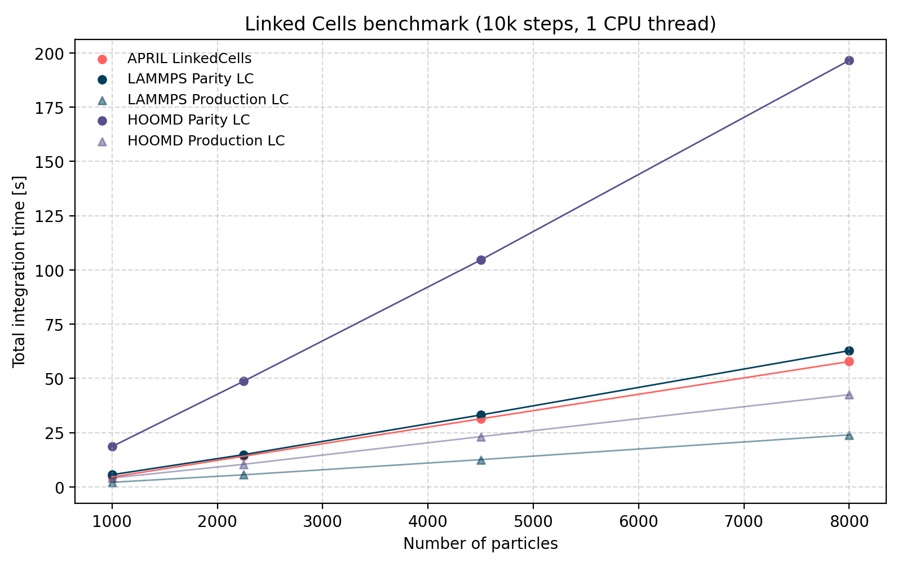

# APRIL -  A Particle Runtime Interaction Library

[](https://github.com/JKKDY/april/actions/workflows/cmake-multi-platform.yml)
[](https://codecov.io/github/JKKDY/april)
[](https://github.com/JKKDY/April/actions)


April is a high-performance, header-only C++23 framework for particle-based simulations. It functions as a physics compiler: users describe particles, interactions, and constraints declaratively, and April generates a specialized simulation engine with fully static dispatch (no virtual calls and no runtime type erasure).

The design is fully modular. Components such as forces, boundaries, containers, and integrators can be freely combined because simulation logic is decoupled from data representation; memory layout (AoS, SoA, AoSoA) is independent of the physics code.


> **Status**: Core architecture & API complete as well as memory layouts (SoA/AoS/AoSoA)  
> **Next**: SIMD integration


## Minimal Example

```c++
#include <april/april.hpp>
using namespace april;

// Simulation of a simple sun-planet-moon system
int main() {
    
    // 1) Define particles and interactions
    auto sun = Particle().at(0, 0, 0).with_mass(1.0).as_type(0);
    auto planet = Particle().at(1, 0, 0).with_velocity(0, 1, 0).with_mass(1e-3).as_type(0);
    auto moon = Particle().at(1.05, 0, 0).with_velocity(0, 1.2, 0).with_mass(1e-6).as_type(0);

    auto env = Environment(forces<Gravity>, boundaries<Open>)
        .with_particles({sun, planet, moon})
        .with_force(Gravity(), to_type(0))
        .with_boundaries(Open(), all_faces); 

    // 2) Choose a container (force calculation strategy)
    auto container = DirectSumAoS();
    auto system = build_system(env, container); // "compilation step"

    // 3)  Integrate and write output
    VelocityVerlet(system, monitors<BinaryOutput>)
        .with_monitor(BinaryOutput(Trigger::every(40), "output/"))
        .with_dt(0.005)
        .for_duration(200)
        .run();                           
}
```


## Core Features


#### 1. Modular Architecture

April offers several different types of component classes. Components of a given type can be swapped interchangeably.

* **Boundaries**: Topological domain constraints.
* **Containers**: Spatial data structures. Hold particle data, specify iteration behavior.
* **Controllers**: Runtime state modifiers. Can be used e.g. to build thermostats.
* **Fields**: External force fields.
* **Forces**: Pairwise interactions.
* **Integrators**: Propagate the system through time.
* **Monitors**: Non-intrusive observers for output generation.

Users can also build any custom component they desire by satisfying the corresponding interface.


#### 2. Static Configuration & Memory Abstraction


April is built around static configuration and strict separation between physics code and data representation.

* **Compile-Time Configuration**: April makes heavy use of templates for type propagation. Configuration and compatibility errors are caught early at compile time via C++20 Concepts.
* **Build-Time Validation**: The build step (“compilation” of the simulation, not the C++ code) performs additional logical checks (e.g. domain consistency, particle data validity) to ensure a sensible initial simulation state.
* **Zero-Cost Accessors**: Physics code does not access particle storage directly. Instead, components operate on lightweight accessor (“ghost”) structs that abstract the underlying memory layout and are fully optimized away by the compiler.


#### 3. Built-in Components

April ships with a number of ready-to-use components:

* **Boundaries**: Periodic, Reflective, Repulsive, Absorbing, Open.
* **Containers**: `DirectSum`, `LinkedCells`. Each in AoS, SoA, and AoSoA flavors.
* **Controllers**: Simple velocity scaling thermostat.
* **Fields**: `UniformField` (global, constant), `LocalField` (localized, optional temporal dependence).
* **Forces**: Lennard-Jones (12-6), Gravity, Coulomb, Harmonic.
* **Integrators**: Velocity-Verlet, Yoshida4.
* **Monitors**: Binary snapshots, benchmarking, progress bar.

April also provides AoS, SoA, and AoSoA container base classes to facilitate implementing new container algorithms.


## Getting Started

#### 1. Requirements
- **C++23 capable compiler** (e.g. gcc-14, clang 18)
- **CMake ≥ 3.28** (only for examples, tests, benchmarks)
- **GoogleTest** (Optional/Dev): Required for the test suite. The project's CMake is configured to automatically fetch this dependency.

#### 2. How to Build (examples, benchmarks, tests)

Since April is a header-only library, simply copy the headers and `#include <april/april.hpp>`. You can automate this process in CMake with ``FetchContent``:
````CMake
include(FetchContent)

FetchContent_Declare(
  april
  GIT_REPOSITORY https://github.com/JKKDY/april.git
  GIT_TAG        main
)
FetchContent_MakeAvailable(april)
````


To build all examples and development targets, from the project root run:
````bash
cmake -S . -B build -DCMAKE_BUILD_TYPE=Debug
cmake --build build --config Debug
````

To run tests:
```bash
cd build
ctest --output-on-failure --build-config Debug
```

#### 3. Example
This example demonstrates a many-particle simulation with short-range interactions, boundary conditions, and gravity, using linked cells for particle traversal. 


```c++
#include <april/april.hpp>
using namespace april;

int main() {	
	// 1) Generate a block of particles
	auto blob = ParticleCuboid()
        .at(0,0, 10)
        .count(10, 10, 10)
        .spacing(1.2)
        .mass(1.0)
        .type(0)
        .thermal([](vec3 /*pos*/) {
            constexpr double sigma = 1;
            return math::maxwell_boltzmann_velocity(sigma);
        });

	// 2) Define the Environment
	auto env = Environment(
	        forces<LennardJones>,
			boundaries<Reflective>,
			fields<UniformField>
		)
		.with_particles(blob)
		.with_extent(30, 30, 50) // Domain is automatically centered around the particles
		.with_force(LennardJones(3,1), to_type(0))
		.with_field(UniformField({0.0, 0.0, -5})) // gravity
		.with_boundaries(Reflective(), all_faces);

	// 3) Build the system (using Linked Cells for O(N) scaling)
	auto container = LinkedCellsAoS();
	auto system = build_system(env, container);

	// 4) Run the simulation
	VelocityVerlet(system, monitors<ProgressBar, BinaryOutput>)
		.with_monitor(ProgressBar(Trigger::every(50)))
		.with_monitor(BinaryOutput(Trigger::every(50), "output/"))
		.with_dt(0.001)
		.for_duration(10)
		.run();
}
```


## Performance

All benchmarks were performed on a single CPU thread without explicit SIMD.  

**Hardware**: Surface Laptop Studio 2 (Intel i7-11370H, 16 GB RAM)
**Software**: Windows 10 with WSL2 Ubuntu 24.04.1.

All benchmark code and raw data are available in `/benchmarks`.


#### 1. End-to-End Runtime Comparison


Comparative benchmarks were conducted for 10k integration steps with Lennard-Jones (12-6) interactions (ε = 5, σ = 1, cutoff = 3σ, dt = 0.0002).

**System:** simple cubic lattice of varying size (1000-8000 particles).  
**Compilers / Versions:**
- April: (Clang 18.1.3) 
- LAMMPS: Stable Release 22 Jul 2025 (Update 3), built with Kokkos enabled but using standard (non-/kk: no explicit SIMD) force styles (Clang 18.1.3) 
- HOOMD: v5.3.1 (pip install)
  




| Particles | April | LAMMPS | HOOMD |
| --- | --- | --- | --- |
| 8000 | 34.127 | 23.965 | 42.475 |
| 4500 | 18.866 | 12.548 | 23.148 |
| 2250 | 8.934 | 5.561 | 10.406 |
| 1000 | 3.325 | 2.102 | 4.107 |

April is competitive with both LAMMPS and HOOMD, outperforming HOOMD in this configuration. LAMMPS achieves lower runtimes primarily due to algorithmic differences such as Verlet neighbor lists, which reduce the number of non-interacting particle pairs evaluated per step.


#### 2. Zero-Overhead Code Generation

To evaluate overhead of April's code generation, the DirectSum implementation is benchmarked against equivalent handwritten integration loops:

| Configuration | Median Time (s) |
| :--- | :--- |
| **April AOS** | 6.13 |
| **Hardcoded AOS** | 6.16 |
| **April SOA** | 6.06 |
| **Hardcoded SOA** | 6.47 |

April does not introduce measurable abstraction overhead compared to handwritten loops. In the SoA case, April slightly outperforms the manual implementation, due to improved aliasing assumptions available to the compiler (usage of the `restrict` compiler hint).


#### 3. Force Kernel Dispatch Efficiency

To assess force kernel dispatch efficiency, the amortized time per force evaluation was measured for April’s DirectSum and LinkedCells implementations. These results are compared against a very simple hardcoded force update loop (which gives an upper bound to the maximum possible performance) and LAMMPS force evaluation performance. 


| Configuration                  | ns / interaction |
| :----------------------------- | ---------------: |
| Handwritten minimal kernel     | 2.63             |
| April DirectSum                | 3.01             |
| April LinkedCells              | 3.18             |
| LAMMPS                         | 4.09             |


April's force evaluation performance is close to the scalar single-core limit and is on par or faster than LAMMPS in terms of amortized force dispatch cost.  


## Architecture

#### 1. Lifecycle


The following diagram shows the typical flow of a program using April:
```
             [particles]   [boundaries]   [forces]          
                       \        |        /                          
                        v       v       v                           
                         +-------------+        
           [fields] ---> | Environment | <--- [controllers]       
                         +-------------+        
                                |                       
                                |                        
                                v                       
 +-----------+       +---------------------+      
 | Container | ----> |   build_system(...) |  <- The compilation step
 +-----------+       +---------------------+     
                                |
                                v
                           +----------+
                           |  System  |   <— The "compiled" environment
                           +----------+
                                ^
                                |  (each step: system.update_forces)
                                |
                         +--------------+
                         |  Integrator  |
                         +--------------+
                                |
                                |  (emits records based on custom policies)
                                v
                          +-----------+
                          |  Monitors |
                          +-----------+
```

The canonical setup path follows three stages: declare, build, run:

1. **Declarative Setup**
Users describe the physics of the simulation (particles, interactions, domain, boundary conditions, fields, and controllers). No execution occurs at this stage. Declaration is order-independent and purely descriptive. 

2. **Build Step**: The `build_system` function compiles the `Environment`, together with a chosen `Container`, into a simulation-ready `System` object. This involves mapping user-facing IDs/types to dense internal indices, finalizing the domain, building the interaction table, validating consistency and triggering component initialization (e.g. particle data and spatial structures in a `Container`). The `System` is stateful and owns all simulation data including time and step counts.

3. **Execution**: An `Integrator` (templated on `System`), advances the simulation in time. During the execution, attached `Monitors` may emit records based on custom trigger policies. After a run the system remains valid and can be queried or resumed - optionally with a different integrator.

Since April primarily relies on static composition, all component types (e.g. which forces, monitors, etc.) that *could* be used, must be declared at compile time. This is done via named parameter packs in the `Environment` and `Integrator` constructors. The specific objects and their parameters are configured at run time. 


#### 2. Design

April has three architectural goals which dictate its design: 
1. **Easy to use**: clean & expressive API, clear setup path, good discoverability
2. **Modularity & Extensibility**: all components are swappable and user-extensible
3. **Maximum Performance**: Abstraction layers must not introduce overhead

Modern C++ (templates, concepts, `if constexpr`, `deduce this`, CRTP, CTAD) makes these goals compatible with one another by making all code paths visible to the compiler while keeping the user-facing API clean.

These goals lead to the following design decisions:

**Declarative API with an Explicit Build Step**

User-facing objects are either *declarative* (like `Particle` & containers) and hold no executable simulation state or *functional* (e.g. forces and boundaries). Functional objects do not prescribe or expose mutable state through their interface contract; any state they carry is user-defined and opaque to the system.

During the `build_system` step, declarative objects are materialized into internal representations. Functional components are integrated as callable behavior. 

This design discourages API misuse and establishes a clear, canonical setup path. The declarative style also makes simulations easier to write, reason about, and review.


**Static composition over runtime polymorphism and type erasure**
Virtual dispatch introduces indirection (vtable lookups) and prevents inlining which is detrimental in hot paths. 

April therefore uses static composition via `deduce this`, CRTP and traits to eliminate virtual calls and make all code paths visible to the compiler.

Where runtime selection is unavoidable (e.g. multiple force types), `std::variant` (generates a static jump table) and `std::visit` are used. Dispatch points are hoisted outside of inner loops to amortize lookup costs. 

This approach increases compile times due to extensive template instantiation. This is an intentional tradeoff for increased runtime performance. 


**Extensibility via concepts and inheritance**
April's extensibility model is based on static, inheritance-based interfaces. Interface base classes expose extension points via `deduce this` methods, which either call the corresponding subclass implementation or - in some cases where implementation is optional - fall back to a default implementation. Corresponding concepts check for inheritance and ensure the required interface is satisfied.

User-defined components are compiled into the same execution paths as built-in ones i.e., there is no architectural difference between built-in and user components. 


#### 3. Extending April (Quick Look)

The following demonstrates how to extend April, exemplified by implementing a custom force. Forces implement an `eval` function which produces a force vector given two particles and their relative displacement vector `r`.

```c++
struct MyForce : Force{
    using Force::Force; // or define your own constructor

    // fields you want to access in the eval function must be explicitly
    // stated at compile time. if you try to access a field not stated here 
    // the compiler will complain
    static constexpr env::FieldMask fields = env::Field::position | env::Field::velocity;

    // p1, p2 are particle views; hold const references to the actual data
    vec3 eval(auto p1, auto p2, const vec3& r) const noexcept {
        // fields can be accessed with p1.position, p2.velocity ..    
        return ...         
    }
};
```

## License

April is licensed under **AGPLv3**.
Small users (individuals, academia, non-profits, and SMEs) are granted an exception via an explicit license exception that **waives the AGPL network-use (Section 13) requirement**, allowing private internal services and APIs.
Larger organizations must comply with AGPLv3 or obtain a commercial license.

See `LICENSE` and `LICENSE-EXCEPTION.md` for details.


## Roadmap

Planned additions (subject to change)

**Foundational**: 
- [x] Boundaries & boundary conditions
- [x] Controllers: e.g. thermostats
- [x] Force fields, including time-dependent fields

**Performance**: 
- [x] SoA
- [x] AoSoA
- [ ] SIMD support
- [ ] Parallelism

**Features**: 
- [x] Yoshida4
- [ ] Boris Pusher Integrator
- [ ] Barnes-Hut Container
- [ ] Verlet Clusters
- [ ] Compute Pipelines

**Secondary Features**: 
- [x] Extendable particles via template parameter (e.g. add charge property)
- [ ] ~~C++ Modules~~ (wait for more widespread compiler support)
- [ ] more build feedback from `build_system` (e.g. spatial partition parameters) 
- [ ] VTU output

**Project**:
- [x] Continuous integration
- [ ] Docs
- [ ] Python Binding

<!-- Far Future:
- [ ] ML potentials
- [ ] Hybrid containers; different containers for different particle types;
- [ ] Run time container switching via policy
- [ ] Rigid bodies / constraints
- [ ] Custom compute pipelines
- [ ] Auto Tuning like AutoPas

To explore? 
- [ ] relativistic simulations
- [ ] replicating particles + active matter
- [ ] communication "bridges"/"pipes" between components
- [ ] econophysics style simulations -->


